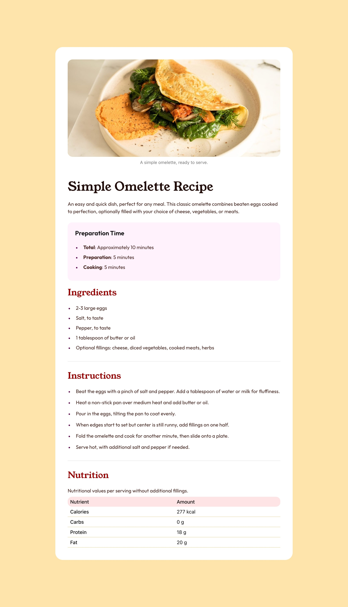

# Frontend Mentor - Recipe page solution

This is a solution to the [Recipe page challenge on Frontend Mentor](https://www.frontendmentor.io/challenges/recipe-page-KiTsR8QQKm). Frontend Mentor challenges help you improve your coding skills by building realistic projects.

## Table of contents

- [Overview](#overview)
  - [Screenshot](#screenshot)
  - [Links](#links)
- [My process](#my-process)
  - [Built with](#built-with)
  - [What I did](#what-i-did)
  - [Problems](#problems)
- [Author](#author)

## Overview

### Screenshot

### Links

- Solution URL: [Solution URL](https://github.com/joao-almeida11/recipe-page-frontendmentor)
- Live Site URL: [Live site URL](https://joao-almeida11.github.io/recipe-page-frontendmentor)

## My process

### Built with

- Semantic HTML5 markup
- [TailwindCSS](https://tailwindcss.com/)
- [Nextjs](https://nextjs.org/) - A React.js framework
- Mobile-first workflow

### What I did

- developed the components in atoms/molecules
- nextjs static export

### Problems

- I seem to have an overflow-x but can't seem to find its cause, so i forcefully removed it.

## Author

- Website - [Joao Almeida](https://joao-almeida11.github.io/portfolio-2025/)
- Frontend Mentor - [@joao-almeida11](https://www.frontendmentor.io/profile/joao-almeida11)
